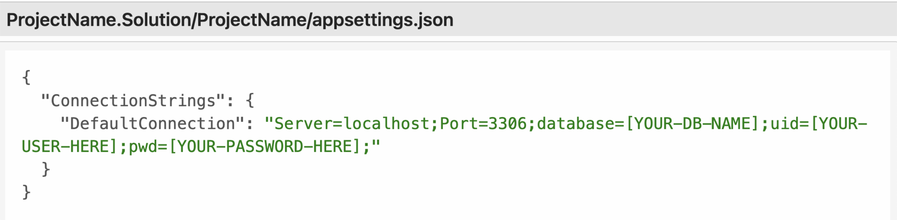

# Dr. Sillystringz's Factory
Names of contributors: By Viradeth Xay-ananh.  
MVC web application for Dr. Sillystringz's Factory.

# Description 
MVC Web application that allows a manager to add a engineer to a list and view all the list of engineers.  The manager can also add a machine to a list and view of list of machines.  The manager can also add a machine to a engineer and vice versa (engineer to a machine)

## Technologies Used
* C#
* Dot Net 6.0
* Markup
* Git
* ASP.NET MVC
* css
* Html5
* Microsoft EntityFramework Core

# Complete setup/Installation instructions:
* Clone repository to your desktop 
* CD to the Directory: Factory
* While in the current directory [Factory]  
* Create appsettings.json file 
* Replace the following values shown in image with: 
* [YOUR-DB-NAME]: database included in project
* [YOUR-USER-HERE]: with your username
* [YOUR-PASSWORD-HERE]: with your password
* Enter in command: 'dotnet ef database update'
* Add the appsettings.json file to .gitignore to protect the sensitive data
* To view web application. Run commands: dotnet watch run 
* Open the browser, go to https://localhost:5001

# Known bugs: 
No bugs 

## License

[MIT](https://opensource.org/licenses/MIT)  
Copyright (c) _03/17/2023_ _viradeth xay-ananh_